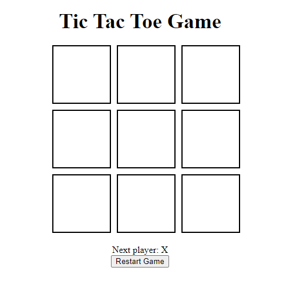
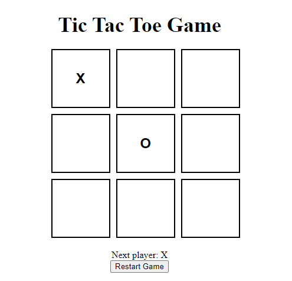
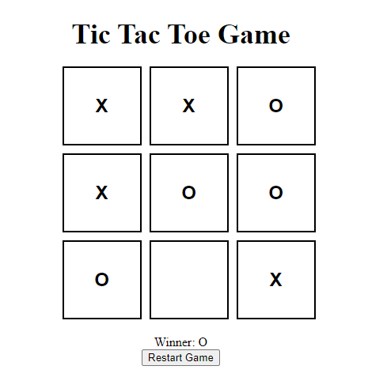

# Tic Tac Toe with React

This Tic Tac Toe game is a simple implementation using React. Players alternate turns to place their symbols (X or O) on a 3x3 grid, aiming to align three of their symbols horizontally, vertically, or diagonally. 

## Features

- **Interactive Gameplay**: Clickable squares for easy play.
- **Winning Detection**: Automatically checks for a winner after each move.
- **Draw Condition**: Identifies when the game ends in a draw.
- **Restart Option**: Easily reset the game at any time.

